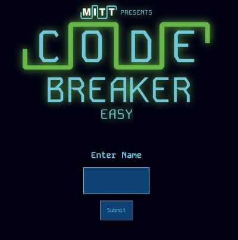

# Code-Breaker
## Overview
Code Breaker is one of my oldest games, which has gone through many different updates. It is now designed to be a showcase of frontend development skills that I acquired at MITT. The gameplay is that of Mastermind, where you make guesses and get clues for your next guess. Try for a new highscore! 

## Features
- Object Oriented Code Design
- Appealing UI
- CSS transitions and animations
- Background sound and sound effects
- Dynamic element creation
- Game timer
- Player name input
- Profanity regex
- Game rules (which pause the timer if clicked while playing)
- Two modes of game play (Easy/Hard)
- Persistant scoreboards (local memory) for both modes

### Languages Used 

### Say Hi
If you have an comments or suggestions, please don't hesitate to reach out :)

### Preview

Music by <a href="https://pixabay.com/users/gioelefazzeri-16466931/?utm_source=link-attribution&utm_medium=referral&utm_campaign=music&utm_content=95450">Gioele Fazzeri</a> from <a href="https://pixabay.com//?utm_source=link-attribution&utm_medium=referral&utm_campaign=music&utm_content=95450">Pixabay</a>

Sound Effect by <a href="https://pixabay.com/users/freesoundsxx-47251115/?utm_source=link-attribution&utm_medium=referral&utm_campaign=music&utm_content=269718">FreeSoundsxx</a> from <a href="https://pixabay.com/sound-effects//?utm_source=link-attribution&utm_medium=referral&utm_campaign=music&utm_content=269718">Pixabay</a>

Sound Effect by <a href="https://pixabay.com/users/floraphonic-38928062/?utm_source=link-attribution&utm_medium=referral&utm_campaign=music&utm_content=183948">floraphonic</a> from <a href="https://pixabay.com//?utm_source=link-attribution&utm_medium=referral&utm_campaign=music&utm_content=183948">Pixabay</a>

Sound Effect by <a href="https://pixabay.com/users/audiosto-40753689/?utm_source=link-attribution&utm_medium=referral&utm_campaign=music&utm_content=199830">Audiosto</a> from <a href="https://pixabay.com/sound-effects//?utm_source=link-attribution&utm_medium=referral&utm_campaign=music&utm_content=199830">Pixabay</a>